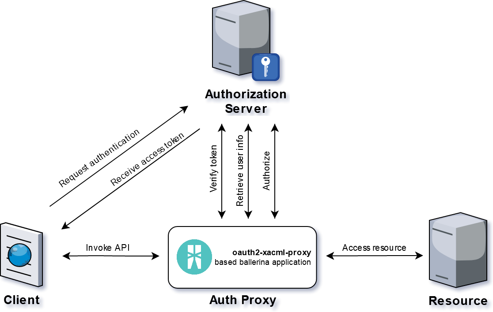

OAuth2 XACML Ballerina Proxy Connector

# Module Overview

This connector acts as an API proxy, allows you to add a security layer for unprotected resources, verifying oauth2 opaque token passed as a authorization bearer token. Optionally the connector can perform an XACML query to check permission policies.

This component does not perform token generation, but simply checks its validity. A typical use case is a SPA that independently obtains an oauth2 token following a selected grant type, then calls in a single sign on context various REST backend services protected with this connector.



Ballerina applications based on this connector can manipulate both the request sent by the caller, before being forwarded to the destination endpoint, and the response generated by the remote service, before being sent back to the caller.

To reduce latency and increase general performance this connector supports a cache mechanism for token validity, user info and authorization decisions, so it's not necessary to call the authorization server for each API invokation

>It is important to consider the performance and security trade-offs when deciding to cache the values. Shorter cache expiration times will result in higher security since the resource servers will have to query the introspection endpoint more frequently, but will result in an increased load on the endpoint. Longer expiration times leave a window open where a token may actually be expired or revoked, but still be able to be used at a resource server for the remaining duration of the cache time.

it's also possible to configure a circuit breaker to gracefully handle network related errors.

The main reason why I developed this library is the absence of an InboundOAuth2Provider in the early versions of Ballerina SDK.

A concrete example of an application using this connector is [jasperserver-oauth2-proxy](https://github.com/giuseppeamato/jasperserver-oauth2-proxy)

Tested with WSO2 Identity Server 5.8.

Published on Ballerina central: <https://central.ballerina.io/pz8/oauth2_xacml>

## Compatibility

|                          |    Version     |
|:------------------------:|:--------------:|
| Ballerina Language       | 1.2.4          |
| XACML                    | 3.0            |

## Getting Started

You can pull the module from Ballerina Central using the command:
```bash
$ ballerina pull pz8/oauth2_xacml
```

Import the `pz8/oauth2_xacml` module into your Ballerina project.
```ballerina
import pz8/oauth2_xacml;
```

Set the proper attributes in the configuration object, usually filled in a toml configuration file, and instantiate the connector
```ballerina

oauth2_xacml:GatewayConfiguration gatewayConf = {
   idsEndpoint: config:getAsString("oauth2_xacml.endpoint"),
   idsUsername: config:getAsString("oauth2_xacml.username"),
   idsPassword: config:getAsString("oauth2_xacml.password"),
   truststorePath: config:getAsString("oauth2_xacml.truststorePath"),
   truststorePassword: config:getAsString("oauth2_xacml.truststorePassword"),    
   idsIntrospectPath: config:getAsString("oauth2_xacml.introspectPath"),
   idsUserInfoPath: config:getAsString("oauth2_xacml.userInfoPath"),
   idsAuthorizationPath: config:getAsString("oauth2_xacml.authorizationPath"),
   authenticationCache: {
      size: config:getAsInt("oauth2_xacml.authenticationCache.size"),
      evictionFactor: config:getAsFloat("oauth2_xacml.authenticationCache.evictionFactor"),
      maxAgeInSeconds: config:getAsInt("oauth2_xacml.authenticationCache.maxAgeInSeconds"),
      cleanupIntervalInSeconds: config:getAsInt("oauth2_xacml.authenticationCache.cleanupIntervalInSeconds")
   },
   authorizationCache: {
      size: config:getAsInt("oauth2_xacml.authorizationCache.size"),
      evictionFactor: config:getAsFloat("oauth2_xacml.authorizationCache.evictionFactor"),
      maxAgeInSeconds: config:getAsInt("oauth2_xacml.authorizationCache.maxAgeInSeconds"),
      cleanupIntervalInSeconds: config:getAsInt("oauth2_xacml.authorizationCache.cleanupIntervalInSeconds")
   },
   circuitBreaker: {
      timeWindowInMillis: config:getAsInt("oauth2_xacml.circuitBreaker.timeWindowInMillis"),
      bucketSizeInMillis: config:getAsInt("oauth2_xacml.circuitBreaker.bucketSizeInMillis"),
      requestVolumeThreshold: config:getAsInt("oauth2_xacml.circuitBreaker.requestVolumeThreshold"),
      failureThreshold: config:getAsFloat("oauth2_xacml.circuitBreaker.failureThreshold"),
      resetTimeInMillis: config:getAsInt("oauth2_xacml.circuitBreaker.resetTimeInMillis"),
      statusCodes: check int[].constructFrom(config:getAsArray("oauth2_xacml.circuitBreaker.statusCodes"))
   },
   timeoutInMillis: config:getAsInt("oauth2_xacml.timeoutInMillis", 20000)
};

oauth2_xacml:Client oauth2Client = new(gatewayConf);
```
Concrete example of the configuration file:
```toml
[oauth2_xacml]
endpoint="https://localhost:9443"
username="@encrypted:{+HS3IPMC5RjPiipvk4pXi7dEYosFtIK7RG3iD4i6UAw=}"
password="@encrypted:{ha6s2HX8Vn3efsKlCWZ6nlD932F2qNw9hTbFS8EOjSM=}"
introspectPath="/oauth2/introspect"
userInfoPath="/oauth2/userinfo?schema=openid"
authorizationPath="/api/identity/entitlement/decision/pdp"
truststorePath="./ballerinaTruststore.p12"
truststorePassword="ballerina"    
[oauth2_xacml.authenticationCache]
size=100
evictionFactor=0.2
maxAgeInSeconds=300
cleanupIntervalInSeconds=60
[oauth2_xacml.authorizationCache]
size=1000
evictionFactor=0.1
maxAgeInSeconds=300
cleanupIntervalInSeconds=60
[oauth2_xacml.circuitBreaker]
timeWindowInMillis=10000
bucketSizeInMillis=2000
requestVolumeThreshold=0
failureThreshold=0.2
resetTimeInMillis=10000
statusCodes=[400, 404, 500]

[b7a.log]
level="DEBUG"
```
+ `endpoint`: the base URL of the Authorization Server
+ `username`: username of user on the authorization server allowed to invoke introspection endpoint
+ `password`: password of user on the authorization server allowed to invoke introspection endpoint
+ `introspectPath`: relative path to invoke the OAuth introspection endpoint and validate the token
+ `userInfoPath`: relative path to invoke the User Profile Information service
+ `authorizationPath`: relative path to invoke the Policy Decision Point entitlement service
+ `truststorePath`: path to the .p12 truststore file for SSL connections to the authorization server
+ `truststorePassword`: password for truststore file
+ `timeoutInMillis`: timeout of http connection to the authorization server
+ **`authenticationCache`** / **`authorizationCache`** (**OPTIONAL**)
    + `size`: maximum number of entries allowed for the cache
    + `evictionFactor`: The factor by which the entries will be evicted once the cache is full. The eviction policy is based on LRU algorithm.
    At the time of eviction (**size** * **evictionFactor**) entries get removed from the cache.
    + `maxAgeInSeconds`: expiration of entries in seconds 
    + `cleanupIntervalInSeconds`: The interval time of the task which cleans expired cache entries
+ **`circuitBreaker`** (**OPTIONAL**)
   + `timeWindowInMillis`: Time period in milliseconds for which the failure threshold is calculated.
   + `bucketSizeInMillis`: The granularity (in milliseconds) at which the time window slides.
   + `requestVolumeThreshold`: Minimum number of requests that will trip the circuit
   + `failureThreshold`: The threshold for request failures. When this threshold exceeds, the circuit trips. 
   + `resetTimeInMillis`: The time period (in milliseconds) to wait before attempting to make another request to the upstream service.
   + `statusCodes`: HTTP response status codes that are considered as failures

In your module create a resource to proxy the remote service and invoke the `gateway` method of the connector.
```ballerina
@http:ResourceConfig {
   methods: ["GET"],
   path: "/test"
}
resource function startProcess(http:Caller caller, http:Request request) returns error? {
   var result = oauth2Client->gateway(caller, request, testClient, "/test", true, ());
}
```

The signature of the `gateway` function expects the following parameters:
```ballerina
public remote function gateway(http:Caller caller, http:Request request, 
    http:Client targetClient, string serviceUrl, 
    boolean authorizationEnabled, 
    (function (http:Request, json) returns (http:Request))|() transformCallback)
```
+ caller - the `http:Caller` that makes the request
+ request - the `http:Request` object
+ targetClient - an `http:Client` configured in your project for the remote endpoint
+ serviceUrl - path of the remote resource
+ authorizationEnabled - if `true` the connector makes an xacml query to the policy decision point, passing as a parameters the current logged username, the path of the remote resource and the http request method
+ transformCallback - callback function called before forwarding payload to remote endpoint. The `nil` value `()` represents the absence of callback function to manipulate the request.

# Transform request

To manipulate di request before it's sent to the proxied service, you need to pass a callback function to the connector. The signature of the callback function expects the `http:Request` object and a json object that represents the user data obtained through the OAuth2 token.

For example:

```ballerina
@http:ResourceConfig {
   methods: ["GET"],
   path: "/test"
}
resource function startProcess(http:Caller caller, http:Request request) returns error? {
   string remoteUrl = "/test";
   var result = oauth2Client->gateway(caller, request, testClient, remoteUrl, true, setHeader);
}

function setHeader(http:Request request, json userInfo) returns http:Request {
    request.addHeader("x-sso-roles", userInfo.groups.toString());
    return request;
}
```

# Transform response

If you need to manipulate the response before it's sent back to the caller, you have to invoke the `process` method
instead of `gateway`. The `process` method performs all the operations of the other except the reply to the caller, giving you the opportunity to make the appropriate transformations.
The `process` method expects the same parameters of the `gateway` method, but returns the `http:Response` related to the remote service or an error object. After the transformations you have to call the `responseToCaller` method on the oauth2client connector.

For example:

```ballerina
@http:ResourceConfig {
   methods: ["GET"],
   path: "/test"
}
resource function startProcess(http:Caller caller, http:Request request) returns error? {
   string remoteUrl = "/test";
   var response = oauth2Client->process(caller, request, testClient, serviceUrl, true, ());
   if (response is http:Response) {
      json payload = check response.getJsonPayload();
      string jsonReplaced = stringutils:replace(payload.toJsonString(), "${title}", "Custom Title");
      response.setJsonPayload(check jsonReplaced.fromJsonString());
   }
   var clientResult = oauth2Client->responseToCaller(caller, response);
}
```

# Authorization requests

If it's passed `authorizationEnabled` parameter as true the connector makes an xacml query to the policy decision point, passing as a parameters the current logged username, the path of the remote resource and the http request method.

For example, the user `myuser`, which has role `operator` on the identity provider, invoke the API `/api/test` on the ballerina service endpoint with `GET` http method. The connector produce the following payload for the PDP:

```json
{
   "Request": {
      "AccessSubject": {
         "Attribute": [{
            "AttributeId": "subject-id",
            "Value": "myuser"
         }]
      },
      "Resource": {
         "Attribute": [{
            "AttributeId": "resource-id",
            "Value": "/api/test"
         }]
      },
      "Action": {
         "Attribute": [{
            "AttributeId": "action-id",
            "Value": "GET"
         }]
      }
   }
}
```

## An example Policy Rule

On the Policy Decision Point is published the following policy rule:
```xml
<Policy xmlns="urn:oasis:names:tc:xacml:3.0:core:schema:wd-17" PolicyId="TestPolicy" RuleCombiningAlgId="urn:oasis:names:tc:xacml:3.0:rule-combining-algorithm:deny-unless-permit" Version="1.0">
   <Target>
      <AnyOf>
         <AllOf>
            <Match MatchId="urn:oasis:names:tc:xacml:1.0:function:string-regexp-match">
               <AttributeValue DataType="http://www.w3.org/2001/XMLSchema#string">/api//*</AttributeValue>
               <AttributeDesignator AttributeId="urn:oasis:names:tc:xacml:1.0:resource:resource-id" Category="urn:oasis:names:tc:xacml:3.0:attribute-category:resource" DataType="http://www.w3.org/2001/XMLSchema#string" MustBePresent="true"/>
            </Match>
         </AllOf>
      </AnyOf>
   </Target>
   <Rule Effect="Permit" RuleId="TestRule">
      <Target>
         <AnyOf>
            <AllOf>
               <Match MatchId="urn:oasis:names:tc:xacml:1.0:function:string-equal">
                  <AttributeValue DataType="http://www.w3.org/2001/XMLSchema#string">/test</AttributeValue>
                  <AttributeDesignator AttributeId="urn:oasis:names:tc:xacml:1.0:resource:resource-id" Category="urn:oasis:names:tc:xacml:3.0:attribute-category:resource" DataType="http://www.w3.org/2001/XMLSchema#string" MustBePresent="true"/>
               </Match>
            </AllOf>
         </AnyOf>
         <AnyOf>
            <AllOf>
               <Match MatchId="urn:oasis:names:tc:xacml:1.0:function:string-equal">
                  <AttributeValue DataType="http://www.w3.org/2001/XMLSchema#string">GET</AttributeValue>
                  <AttributeDesignator AttributeId="urn:oasis:names:tc:xacml:1.0:action:action-id" Category="urn:oasis:names:tc:xacml:3.0:attribute-category:action" DataType="http://www.w3.org/2001/XMLSchema#string" MustBePresent="true"/>
               </Match>
            </AllOf>
         </AnyOf>
      </Target>
      <Condition>
         <Apply FunctionId="urn:oasis:names:tc:xacml:1.0:function:any-of">
            <Function FunctionId="urn:oasis:names:tc:xacml:1.0:function:string-equal"/>
            <AttributeValue DataType="http://www.w3.org/2001/XMLSchema#string">operator</AttributeValue>
            <AttributeDesignator AttributeId="http://wso2.org/claims/role" Category="urn:oasis:names:tc:xacml:1.0:subject-category:access-subject" DataType="http://www.w3.org/2001/XMLSchema#string" MustBePresent="true"/>
         </Apply>
      </Condition>
   </Rule>
</Policy>
```
As a result the user is authorized.
